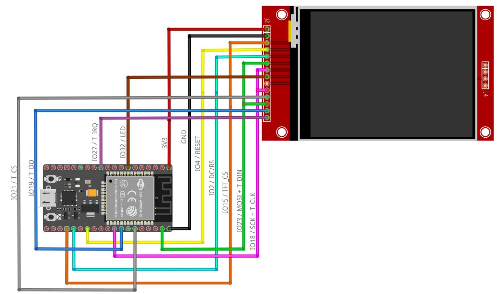

# Instalacion
 
 1. Instalar dependencias: 
    * instalar Arduino IDE 2.0
    * instalar [VisualStudioCode](https://code.visualstudio.com/download) Con La Extension[Plataformio](https://platformio.org/install/ide?install=vscode)
 2. Librerias de arduino necesitadas:
    * [TFT_eSPI](https://github.com/Bodmer/TFT_eSPI)
    * [TJpg_Decoder](https://github.com/Bodmer/TJpg_Decoder)
    * Drivers Actualizados ESP32 
 3. Instalacion De La Pantalla TFT_Display al ESP23:
    
 5.  

