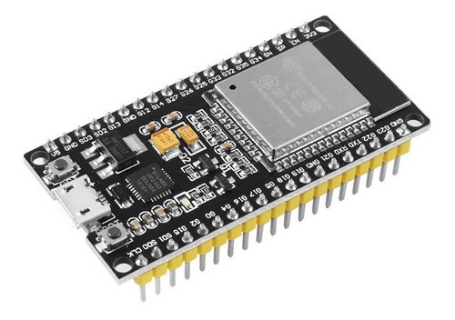
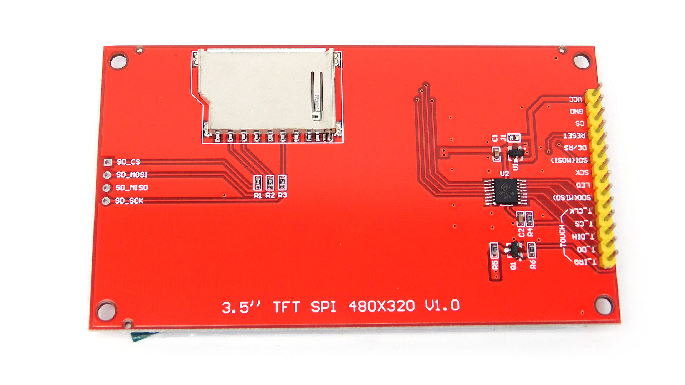
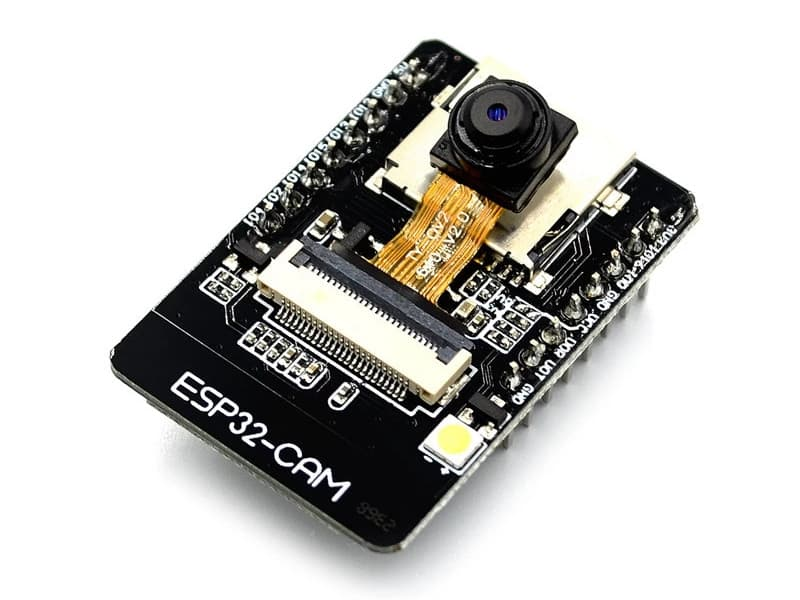
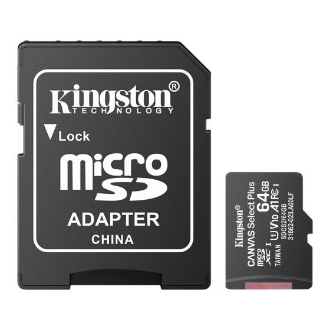

# Implementación de TinyML para el reconocimiento de chiles morrones y visualización de imagenes en una pantalla TFT

En este repositorio se encuentra el proyecto donde se implementa el reconocimiento de chiles morrones utilizando TinyML, asi como el proyecto que se encarga de la visualización de imagenes en una pantalla TFT.

## Requerimientos

### Software

* [Arduino IDE a partir de su versión 2.0](https://www.arduino.cc/en/software)
* [Visual Studio Code (VSCode)](https://code.visualstudio.com/download)
* [PlatformIO (Extensión de VSCode)](https://platformio.org/install/ide?install=vscode)

### Hardware

* ESP32 (En este caso se utiliza la versión de 38 pines)

* Pantalla TFT Display ILI9488

* ESP32-CAM

* Memoria MicroSD

