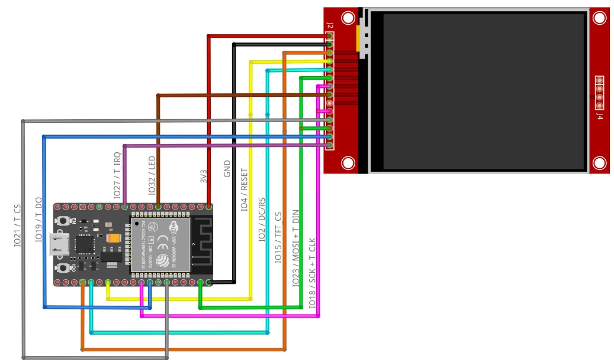
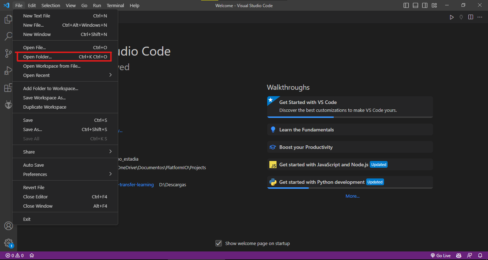
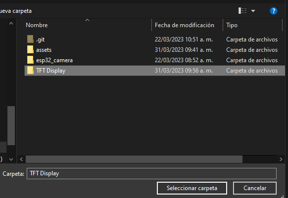
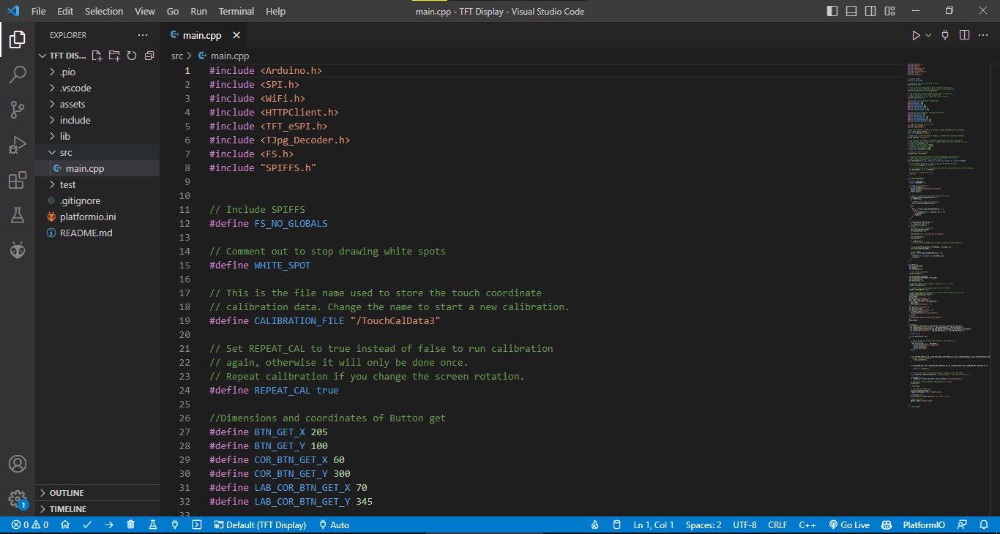
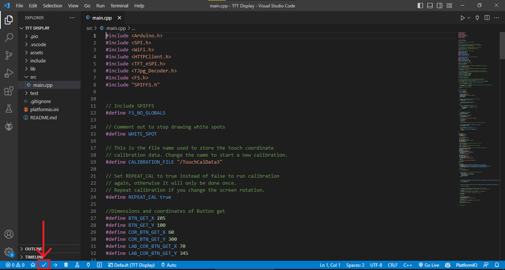
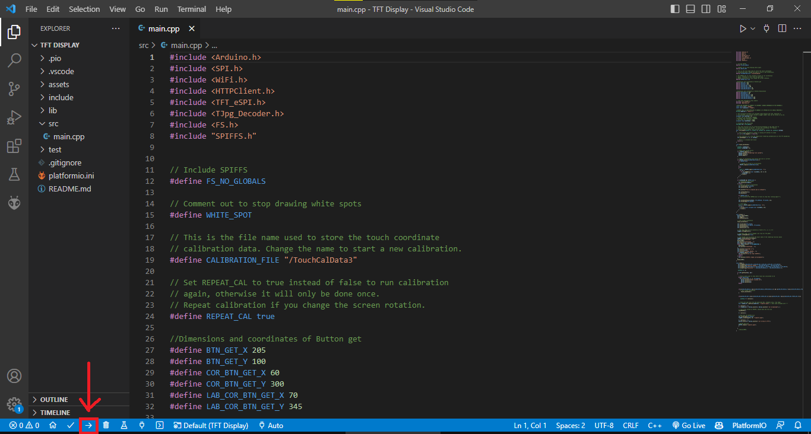

# TFT Display

Este proyecto se encarga de la visualización de imagenes mediante una pantalla TFT y una placa de desarrollo ESP32. Se utiliza el editor de codigo Visual Studio Code con la extensión PlatformIO para la compilación y carga del firmware a la placa de desarrollo.

## Librerias utilizadas

* [TFT_eSPI](https://github.com/Bodmer/TFT_eSPI)
* [TJpg_Decoder](https://github.com/Bodmer/TJpg_Decoder)

## Conexión de la pantalla TFT Display con la placa de desarrollo ESP32



## Apertura del proyecto en Visual Studio Code

Para abrir la carpeta TFT Display en Visual Studio Code se debe seguir los siguientes pasos:

1. Clonar el repositorio en la carpeta deseada (esto en caso de que no se haya clonado el repositorio previamente)
```bash
git clone https://github.com/LeonardoRT200/TFT-Display.git
```
2. Abrir Visual Studio Code

3. Seleccionar la opción "Open Folder"


4. Seleccionar la carpeta TFT Display


Una vez abierta la carpeta se podrá ver el contenido de la misma en el panel de la izquierda, en donde se encuentra el archivo "main.cpp" el cual contiene el codigo fuente del proyecto, asi como los demas archivos necesarios para la compilación y carga del firmware a la placa de desarrollo.



## Compilación y carga del firmware

Si solo se desea compilar el proyecto para verificar que no existan errores de sintaxis, se debe seleccionar la opción "Build" en el panel de la parte inferior.


Si se desea compilar y cargar el firmware a la placa de desarrollo se debe seleccionar la opción "Upload" en el panel de la parte inferior.


## NOTAS

* Las librerías mencionadas anteriormente se encuentran en la carpeta "lib", por lo que no es necesario instalarlas manualmente.

* La libreria TFT_eSPI contiene un archivo llamado User_Setup.h el cual contiene las configuraciones para la pantalla TFT, asi como los pines de conexión de la pantalla. En este archivo se cambia el driver dependiendo del modelo de pantalla que se va a utilizar además de los pines de conexión con la placa de desarrollo.
