# Reconocimiento de chiles morrones utilizando TinyML

Este proyecto se encarga de reconocer chiles morrones mediante imagenes las cuales son capturadas por una placa de desarrollo ESP32-CAM para posteriormente ser clasificadas utilizando un modelo de Tiny Machine Learning (TinyML) entrenado usando la plataforma de [Edge Impulse](https://www.edgeimpulse.com/).

## Antes de empezar

En caso de no tener instalados los drivers para la placa de desarrollo ESP32-CAM, se debe seguir los siguientes pasos:

1. Abrir Arduino IDE

2. Seleccionar la opción "File" -> "Preferences"
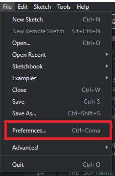

3. En la ventana que se abrió se debe ingresar la siguiente URL en el campo "Additional Boards Manager URLs" y finalmente seleccionar la opción "OK".
```bash
https://raw.githubusercontent.com/espressif/arduino-esp32/gh-pages/package_esp32_index.json
```
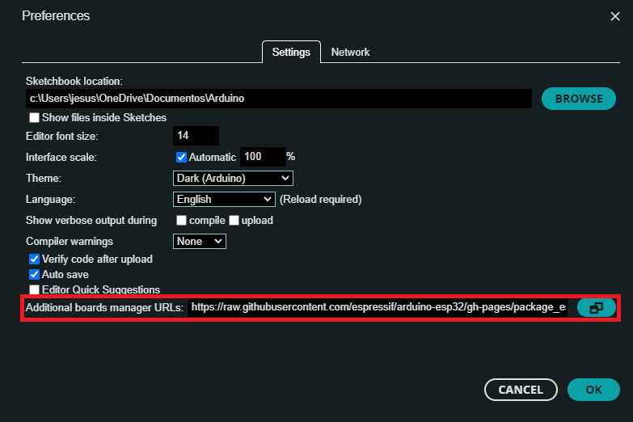

4. Seleccionar la opción "Tools" -> "Board" -> "Boards Manager..."
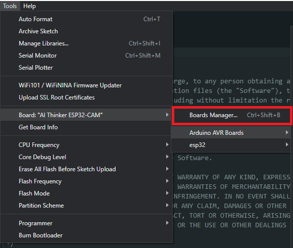

5. En la ventana que se abrió en la parte izquierda se debe buscar "esp32" e instalar la versión más reciente.
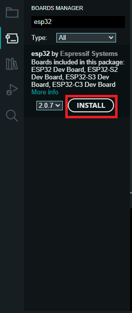

6. Seleccionar la placa "AI Thinker ESP32-CAM" y el puerto correspondiente en el panel de la parte superior.
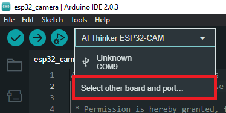
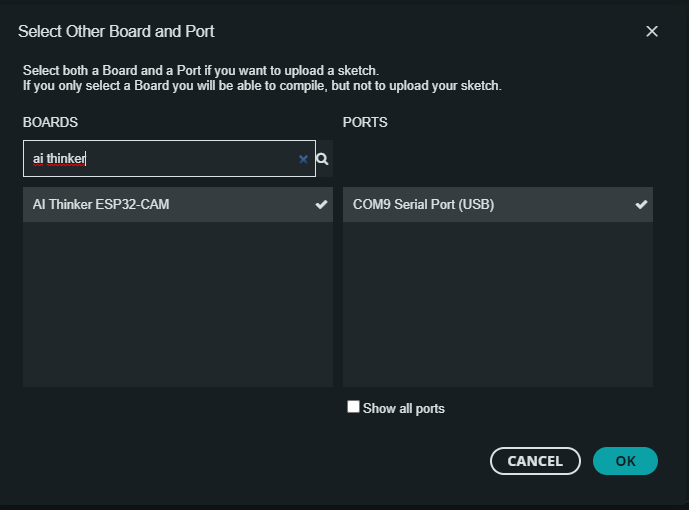

## Apertura del proyecto en Arduino IDE

Para abrir el proyecto en Arduino IDE se debe seguir los siguientes pasos:

1. Clonar el repositorio en la carpeta deseada (esto en caso de que no se haya clonado el repositorio previamente)
```bash
git clone https://github.com/LeonardoRT200/TFT-Display.git
```

2. Abrir Arduino IDE

3. Seleccionar la opción "File" -> "Open..."
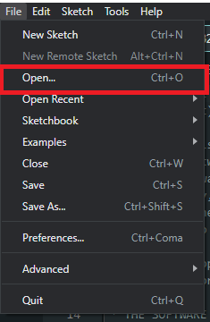

4. Abrir la carpeta esp32_camera y seleccionar el archivo "esp32_camera.ino"
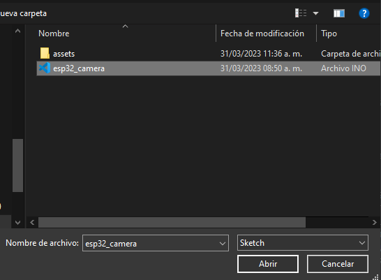

## Importacion de librería del modelo

Para importar la librería que continene el modelo se deben seguir los siguientes pasos:

1. Seleccionar la opción "Sketch" -> "Include Library" -> "Add .ZIP Library..."
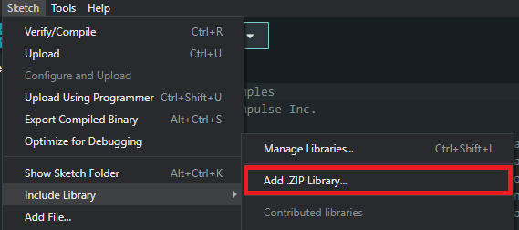

2. Seleccionar ya sea el archivo "ei-bell-peppers-arduino.zip" o el archivo "ei-jalapeno_pepper-arduino" dependiendo del modelo que se desea utilizar, ambos archivos se encuentran en la carpeta "models" del proyecto.
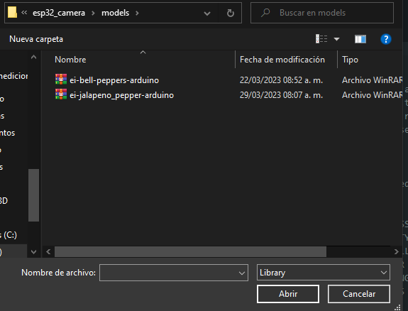

## Compilación y carga del firmware

Para compilar y cargar el firmware a la placa de desarrollo se debe seleccionar el boton "Upload" en la parte superior de la ventana de Arduino IDE.
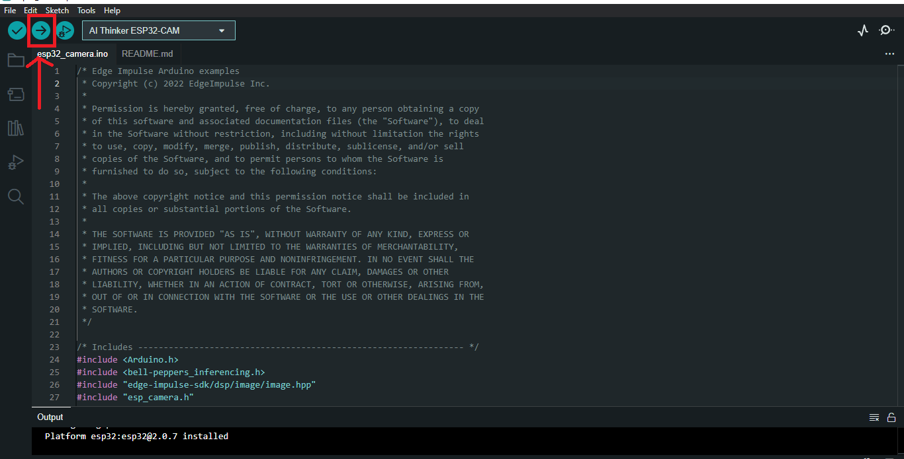


